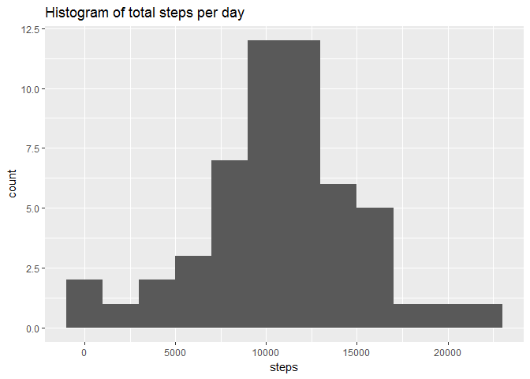
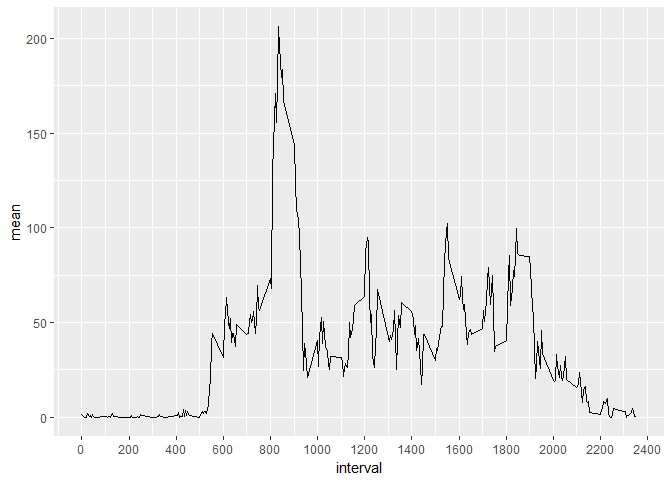
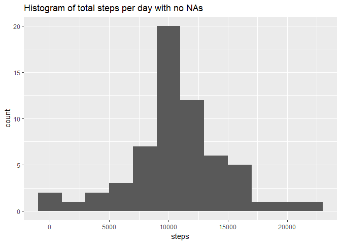
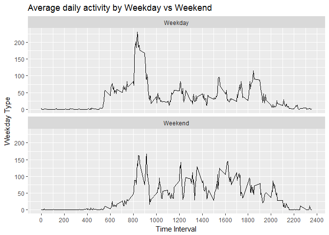

```r
library(tidyverse)
library(knitr)
knitr::opts_chunk$set(warning = FALSE)
knitr::opts_chunk$set(message = FALSE)
```

### Loading and preprocessing the data


```r
setwd("C://UserData/OneDrive - Red Ventures/DSAcceleratorRepos/RRFiles/RepData_PeerAssessment1/activity")
activity <- read.csv("activity.csv", stringsAsFactors = FALSE)
activity$date <- as.Date(activity$date,"%Y-%m-%d")
```

### Make a histogram of the total number of steps taken each day

```r
activity %>%
  filter(!is.na(steps)) %>%
  group_by(date) %>%
  summarize(steps = sum(steps)) %>% 
  ggplot(aes(steps)) +
    geom_histogram(binwidth = 2000) + 
    labs(title = "Histogram of total steps per day")
```

<!-- -->
  

### What is mean total number of steps taken per day?  
For both the mean and median calculations, I removed NAs from the data. Including them in the mean would give NA as the result, and including them in the median alters the result as well, taking it from 10395 to 10795 due to additional rows of NA data.  

```r
# Mean with NAs removed
activity %>%
  group_by(date) %>%
  summarize(total_steps_narm = sum(steps, na.rm = TRUE)) %>%
  ungroup() %>%
  summarize(mean_total = mean(total_steps_narm))
```

```
## # A tibble: 1 x 1
##   mean_total
##        <dbl>
## 1    9354.23
```


### What is the median total number of steps taken per day?

```r
activity %>%
  group_by(date) %>%
  summarize(total_steps = sum(steps, na.rm = TRUE)) %>%
  arrange(total_steps) %>%
  ungroup() %>%
  summarize(med_total = median(total_steps, na.rm = TRUE))
```

```
## # A tibble: 1 x 1
##   med_total
##       <int>
## 1     10395
```

### What is the average daily activity pattern?

```r
# Create a plot showing the average patterns within a day
activity %>%
  group_by(interval) %>%
  summarize(mean = mean(steps, na.rm = TRUE)) %>%
  ggplot(aes(interval, mean)) + 
  geom_line() +
  scale_x_continuous(breaks = seq(0,2400,200))
```

<!-- -->

```r
# Determine the max interval: 
activity %>%
    group_by(interval) %>%
    summarize(mean = mean(steps, na.rm = TRUE)) %>%
    arrange(desc(mean)) %>%
    head(1)
```

```
## # A tibble: 1 x 2
##   interval     mean
##      <int>    <dbl>
## 1      835 206.1698
```


### Imputing missing values  
1. Calculate and report the total number of missing values in the dataset (i.e. the total number of rows with NAs).  

```r
activity %>%
  filter(is.na(steps)) %>%
  count()
```

```
## # A tibble: 1 x 1
##       n
##   <int>
## 1  2304
```

2. Devise a strategy for filling in all of the missing values in the dataset. The strategy does not need to be sophisticated. For example, you could use the mean/median for that day, or the mean for that 5-minute interval, etc.  
**I created a new column getting the mean of each interval and then substituted that mean (rounded to nearest whole number) to replace any NA values.**  
3. Create a new dataset that is equal to the original dataset but with the missing data filled in.  

```r
activity_filled <- activity %>%
  group_by(interval) %>%
  mutate(interval_mean = mean(steps, na.rm = TRUE)) %>%
  mutate(steps = ifelse(is.na(steps),round(interval_mean,0),steps))

head(activity_filled)
```

```
## # A tibble: 6 x 4
## # Groups:   interval [6]
##   steps       date interval interval_mean
##   <dbl>     <date>    <int>         <dbl>
## 1     2 2012-10-01        0     1.7169811
## 2     0 2012-10-01        5     0.3396226
## 3     0 2012-10-01       10     0.1320755
## 4     0 2012-10-01       15     0.1509434
## 5     0 2012-10-01       20     0.0754717
## 6     2 2012-10-01       25     2.0943396
```


4. Make a histogram of the total number of steps taken each day and calculate and report the mean and median total number of steps taken per day. Do these values differ from the estimates from the first part of the assignment? What is the impact of imputing missing data on the estimates of the total daily number of steps?  

**The mean steps per day increases by ~1,000 by adding the imputed data, and the median increases by ~400 steps per day.**   

```r
activity_filled %>%
  group_by(date) %>%
  summarize(steps = sum(steps)) %>% 
  ggplot(aes(steps)) +
    geom_histogram(binwidth = 2000) + 
    labs(title = "Histogram of total steps per day with no NAs")
```

<!-- -->

```r
# Calculate mean
activity_filled %>%
  group_by(date) %>%
  summarize(total_steps = sum(steps)) %>%
  ungroup() %>%
  summarize(mean = mean(total_steps))
```

```
## # A tibble: 1 x 1
##       mean
##      <dbl>
## 1 10765.64
```

```r
# Calculate median
activity_filled %>%
  group_by(date) %>%
  summarize(total_steps = sum(steps)) %>%
  ungroup() %>%
  arrange(total_steps) %>%
  summarize(median = median(total_steps))
```

```
## # A tibble: 1 x 1
##   median
##    <dbl>
## 1  10762
```


### Are there differences in activity patterns between weekdays and weekends?  

**On both weekdays and weekends, there is a spike in activity starting around 8am. That spike is higher on the weekdays but then trickles off for most of the day, with additional small spikes around 3pm and 6:30pm. During the weekend, the 8am spike isn't as high, but there is a pattern of sustained activity throughout the day as compared to the weekday average.**   


```r
# I created the Weekday/Weekend column using weekdays() and then got the average by week_type and interval to plot.
activity_filled %>% 
  mutate(dow = weekdays(date), 
         week_type = ifelse(dow %in% c("Saturday", "Sunday"), "Weekend", "Weekday")) %>%
  group_by(interval, week_type) %>%
  mutate(interval_weektype_avg = mean(steps)) %>%
# Starting the plot here
  ggplot(aes(interval, interval_weektype_avg)) +
  geom_line() +
  facet_wrap(~ week_type, nrow = 2) +
  labs(title = "Average daily activity by Weekday vs Weekend",
       x = "Time Interval",
       y = "Weekday Type") +
  scale_x_continuous(breaks = seq(0,2400,200))
```

<!-- -->
